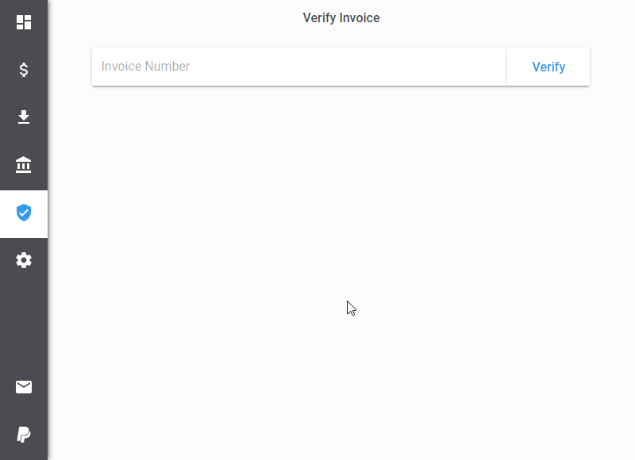

# &nbsp;Publisher Extension for Unity3D

[link-cws]: https://chrome.google.com/webstore/detail/refined-github/ehdmigcaggmfjjoglomaceenckdkacpl
[link-amo]: https://addons.mozilla.org/en-US/firefox/addon/publisher-dashboard-unity3d/

> This extension is in no way affiliated with, authorized, maintained, sponsored or endorsed by Unity Technologies or any of its affiliates or subsidiaries.

  

This extension allows you to access your publisher information right from your browser.

## Download

- [Firefox][link-amo]  &nbsp; [][link-amo]

- [Chrome][link-cws]  &nbsp; [][link-cws]

## Highlights

### Setup Process

  

### Sales

  

### Downloads

  

### Revenue

  

### Invoice Verification

  

### Reviews

  

### Trend Analysis

  

